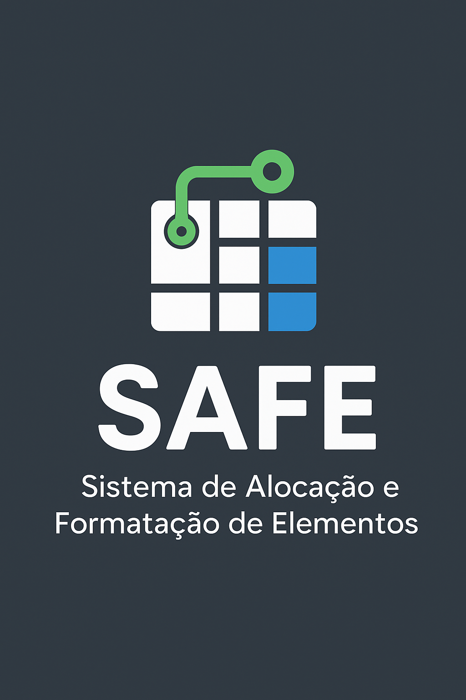

# 🔗 SAFE — Sistema de Alocação e Formatação de Elementos


> Ferramenta moderna de interface gráfica para vincular e mesclar dados entre planilhas Excel e CSV com flexibilidade e elegância.

---

## 🧩 Sobre

O **SAFE** é um aplicativo desktop desenvolvido em Python com uma interface moderna utilizando `ttkbootstrap`. Ele permite a integração de dados de múltiplas colunas entre arquivos Excel (`.xlsx`, `.xls`) e CSV, oferecendo opções de seleção automática ou manual das colunas-chave para mesclagem.

---

## 🖼️ Interface

  
*Logo do SAFE*

  
*Interface do SAFE*

---

## 🚀 Funcionalidades

- 📂 Suporte para carregamento de arquivos `.xlsx`, `.xls` e `.csv`.
- 🔍 Opção de pular linhas iniciais nos arquivos durante o carregamento.
- ⚙️ Modos de operação:
  - **Automático**: Identifica colunas comuns entre arquivos.
  - **Manual**: Permite a seleção explícita de colunas.
- 📋 Seleção múltipla de colunas com interface de listbox e contador de seleção.
- 💾 Salvamento do arquivo resultante com nome e local personalizados.
- 🎨 Interface responsiva com tema `flatly`, barra de progresso e mensagens de feedback visual.

---

## 📁 Estrutura do Projeto

```text
safe-app/
│
├── design1G.py              # Script principal da aplicação
├── requirements.txt         # Dependências do projeto
├── README.md               # Documentação do projeto
├── docs/
│   ├── SAFE-logo.png       # Logo do sistema
│   └── screenshot.png      # Captura de tela da interface
```

---

## 💻 Como Executar

1. **Clone o repositório**:
   ```bash
   git clone https://github.com/seu-usuario/safe-app.git
   cd safe-app
   ```

2. **Crie um ambiente virtual** (opcional, mas recomendado):
   ```bash
   python -m venv venv
   source venv/bin/activate  # Linux/macOS
   venv\Scripts\activate     # Windows
   ```

3. **Instale as dependências**:
   ```bash
   pip install -r requirements.txt
   ```

4. **Execute o sistema**:
   ```bash
   python design1G.py
   ```

---

## 📦 Requisitos

- **Python**: 3.10 ou superior
- **Bibliotecas**:
  - `pandas>=2.0.0`
  - `openpyxl>=3.1.0`
  - `ttkbootstrap>=1.10.1`

Instale manualmente com:
```bash
pip install pandas openpyxl ttkbootstrap
```

---

## 📄 Licença

Este projeto é distribuído sob a licença [MIT](LICENSE).

---

## 👤 Autor

Desenvolvido por Hugo.  
📧 Contato: [Adicione seu e-mail ou LinkedIn aqui]

---

**SAFE — Uma ponte entre planilhas.**